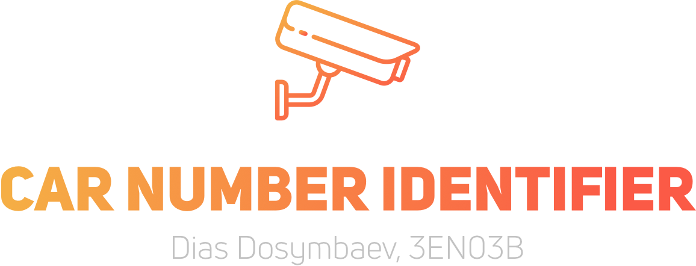

## Final Project on Computer Vision, 2017

| Title                          | Author         |
| ------------------------------ | -------------- |
| _🇰🇿 Car Number Identifier_ | _Dias Dosymbaev_ |

| Item          | Grade | Max Grade  |
| ------------- | ----- | ---------- |
| Code          | 0     | 7 points   |
| Demo          | 0     | 3 points   |
| Poster        | 0     | 5 points   |
| Presentation  | 0     | 5 points   |

### Abstract
Car number identifier works with all types of plates. It is accurate, reliable, easy to install, low maintenance, and very affordable. Originally, it was made to automate the security check system work. It effectively solves this problem.

### How to build and run
Download the code and images of cars from the repository. Open the code in any enviorment with pre-built OpenCV libraries and enjoy!

### Demo
2 min demo video that demonstrates how your project works and how to run it. Upload video to vimeo or youtube. (Vimeo is preferable as it is easy to open in SDU)

### Poster
Click to see the [poster.](pdf/CarNumberIdentifier.pdf)

### Presentation

[Presentation](pdf/presentation.pdf)

# Best of Luck!
